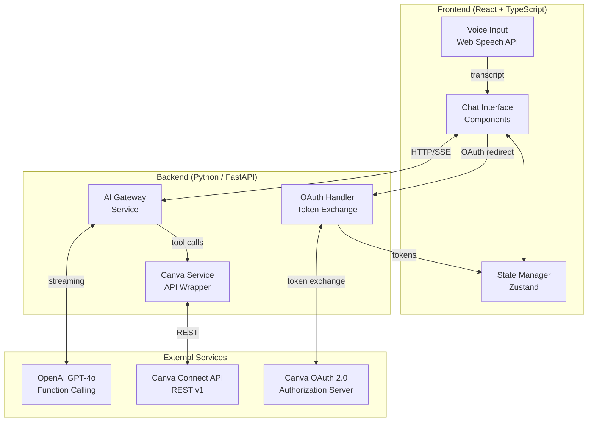
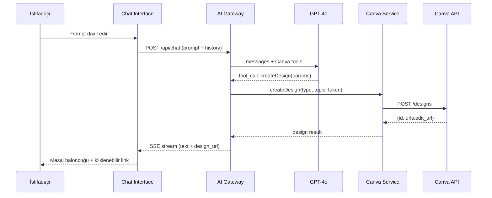
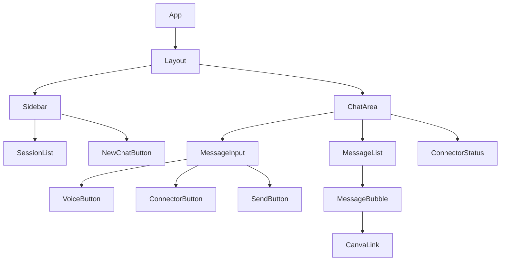
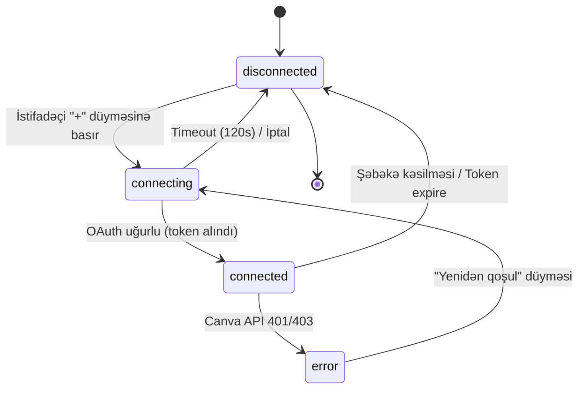

# Design Document: Canva AI Connector

## Brand Identity

### FikirBiz Logo
- **Loqo adı:** FikirBiz — "Fikir" hissəsi ağ (`#FFFFFF`), "Biz" hissəsi qızılı (`#D4AF37`)
- **Loqo fonu:** Tünd lacivert (`#0D1B2A`) — loqonun öz arxa planı
- **Loqo elementi:** Qızılı parlaq ulduz/işıq nöqtəsi "Biz" sözünün üstündə
- **Tipografiya tərzi:** Yüngül, müasir sans-serif (thin/light weight)
- Logo faylı: `public/logo.png` və ya `public/logo.svg`

### Brend Rəng Palitası

| Ad | Hex | İstifadə |
|---|---|---|
| Fil dişi | `#EFE7DC` | Səhifə arxa planı, kart fonu |
| Qızılı | `#D4AF37` | Əsas accent, CTA düymələri, "Biz" loqo rəngi, aktiv vəziyyətlər |
| Xaki | `#5B5A3D` | İkincil mətn, border, deaktiv elementlər |
| Boz | `#CACECF` | Placeholder mətn, ayırıcı xətlər, disabled state |
| Ağ | `#FFFFFF` | Kart/panel arxa planı, "Fikir" loqo rəngi, input fonu |
| Yaşıl | `#217027` | Uğur bildirişləri, "connected" connector statusu |
| Tünd lacivert | `#0D1B2A` | Sidebar arxa planı, loqo fonu, dark elementlər |

### Tailwind CSS Konfiqurasiyası

```typescript
// tailwind.config.ts
export default {
  theme: {
    extend: {
      colors: {
        brand: {
          ivory:  '#EFE7DC',   // fil dişi
          gold:   '#D4AF37',   // qızılı
          khaki:  '#5B5A3D',   // xaki
          gray:   '#CACECF',   // boz
          white:  '#FFFFFF',   // ağ
          green:  '#217027',   // yaşıl
          navy:   '#0D1B2A',   // tünd lacivert (sidebar/logo bg)
        },
      },
      fontFamily: {
        sans: ['Inter', 'ui-sans-serif', 'system-ui'],
      },
    },
  },
}
```

### UI Rəng Tətbiqi

```
Ümumi layout:
  Səhifə arxa planı    → #EFE7DC (fil dişi)
  Sidebar              → #0D1B2A (tünd lacivert)
  Sidebar mətn         → #FFFFFF (ağ)
  Kart/panel           → #FFFFFF (ağ)

Chat interfeysi:
  İstifadəçi mesajı    → arxa plan #D4AF37 (qızılı), mətn #0D1B2A
  AI cavab mesajı      → arxa plan #FFFFFF (ağ), mətn #0D1B2A
  Input sahəsi         → arxa plan #FFFFFF, border #CACECF
  Placeholder          → #CACECF (boz)

Connector statusu:
  Connected            → #217027 (yaşıl) ✓
  Disconnected         → #CACECF (boz)
  Error                → #EF4444 (qırmızı — standart xəta rəngi)

Düymələr:
  Əsas CTA             → #D4AF37 (qızılı), hover: #B8962E
  İkincil              → #5B5A3D (xaki), hover: #3F3E2B
  Deaktiv              → #CACECF (boz)
```

---

## Overview

Bu feature, istifadəçilərin ChatGPT-yə oxşar AI chat interfeysi vasitəsilə Canva MCP connector-u ilə inteqrasiya etməsinə imkan verir. İstifadəçi natural dil promptları (mətn və ya səs) yazaraq Canva-da dizayn, prezentasiya, sosial media postu, poster, banner kimi content növlərini birbaşa yarada bilir.

### Əsas Texniki Qərarlar

- **Frontend**: React + TypeScript — komponent bazlı, güclü tip sistemi
- **State İdarəetməsi**: Zustand — yüngül, hooks-uyğun qlobal state
- **Backend**: Python 3.12 + FastAPI — async, yüksək performanslı REST + SSE
- **Canva İnteqrasiyası**: Canva Connect REST API v1 + OAuth 2.0 PKCE axını — rəsmi Canva developer API ([canva.dev](https://www.canva.dev/docs/connect/))
- **AI Engine**: OpenAI GPT-4o (function calling) — Canva əməliyyatlarını tool call-lara çevirir
- **Səs Girişi**: Web Speech API (`SpeechRecognition`) — brauzer-nativ, pulsuz, sürətli
- **Session Saxlama**: `localStorage` — token şifrəli, serialized JSON
- **Styling**: Tailwind CSS — responsive utility-first

### Araşdırma Tapıntıları

**Canva Connect API:**
- REST tabanlı, baza URL: `https://api.canva.com/rest/v1/`
- OAuth 2.0 Authorization Code + PKCE (SHA-256) axını tələb olunur
- Access token ömrü: 4 saat; refresh token ilə yenilənir
- Token exchange backend-dən edilməlidir (CORS məhdudiyyəti var)
- Design yaratma: `POST /designs` — rate limit 20 req/dəq
- Design siyahısı: `GET /designs` — rate limit 100 req/dəq
- Canva MCP server, AI modellərinin Canva workspace-ə secure giriş əldə etməsinə imkan verir

**Web Speech API:**
- `SpeechRecognition` interfeysi Chrome/Edge-də tam dəstəklənir; Firefox-da məhdud
- `interimResults: true` ilə real-vaxt transkripsiyanı dəstəkləyir
- `onend` hadisəsi ilə 1.5 san fasilə sonra avtomatik dayanır
- Mikrofon icazəsi `navigator.mediaDevices.getUserMedia` ilə alınır

---

## Architecture

Sistem üç əsas qatdan ibarətdir:



### Komponent Qarşılıqlı Əlaqəsi



---

## Components and Interfaces

### Frontend Komponentlər



#### `ChatInterface` — Əsas Orchestrator

```typescript
interface ChatInterfaceProps {
  initialSessionId?: string;
}

// Məsuliyyətlər:
// - Session seçimi və yüklənməsi
// - Message göndərmə axını koordinasiyası
// - Connector status-unun izlənməsi
```

#### `MessageBubble`

```typescript
interface Message {
  id: string;
  role: 'user' | 'assistant';
  content: string;
  timestamp: number;
  canvaLinks?: CanvaDesignLink[];
  isError?: boolean;
}

interface CanvaDesignLink {
  designId: string;
  editUrl: string;
  contentType: CanvaContentType;
  title?: string;
}
```

#### `VoiceInputController`

```typescript
interface VoiceInputState {
  isRecording: boolean;
  isSupported: boolean;
  isPermissionGranted: boolean;
  interimTranscript: string;
  errorCount: number;         // Maks 3 retry
  status: 'idle' | 'requesting_permission' | 'recording' | 'error' | 'unsupported';
}
```

#### `ConnectorButton` + `ConnectorStatusIndicator`

```typescript
type ConnectorStatus = 'connected' | 'disconnected' | 'error' | 'connecting';

interface CanvaConnectorState {
  status: ConnectorStatus;
  lastUpdated: number;
  errorMessage?: string;
  accessToken?: string;        // Şifrəli saxlanır
  refreshToken?: string;       // Şifrəli saxlanır
  tokenExpiresAt?: number;
}
```

### Backend API Endpointləri

```python
# AI Gateway - Server-Sent Events stream (FastAPI)
# POST /api/chat
# Body: ChatRequest
# Response: StreamingResponse (SSE)

from pydantic import BaseModel
from typing import Optional

class ChatRequest(BaseModel):
    prompt: str
    session_id: str
    message_history: list[dict]          # [{"role": "user"|"assistant", "content": str}]
    canva_access_token: Optional[str]    # Connector connected olduqda

# Response: SSE stream
# data: {"type": "text" | "design_url" | "error", "data": "..."}

# OAuth Token Exchange (PKCE)
# POST /api/auth/canva/token
class CanvaTokenRequest(BaseModel):
    code: str
    code_verifier: str
    redirect_uri: str
# Response: {"access_token": str, "refresh_token": str, "expires_in": int}

# Token Refresh
# POST /api/auth/canva/refresh
class CanvaRefreshRequest(BaseModel):
    refresh_token: str
# Response: {"access_token": str, "expires_in": int}
```

---

## Data Models

### Session Model

```typescript
interface Session {
  id: string;               // UUID v4
  name: string;             // İlk mesajdan avtomatik (maks 40 simvol)
  createdAt: number;        // Unix timestamp (ms)
  updatedAt: number;
  messageCount: number;
}

interface MessageHistory {
  sessionId: string;
  messages: Message[];      // Sıralı, zamana görə artan
}
```

### localStorage Saxlama Sxemi

```typescript
// Açarlar:
// "sessions"          → Session[]            (metadata siyahısı)
// "session_{id}"      → MessageHistory       (mesaj tarixi)
// "active_session"    → string               (cari session ID)
// "canva_auth"        → EncryptedAuthState   (şifrəli token məlumatı)

interface EncryptedAuthState {
  encryptedPayload: string;    // AES-GCM şifrəli
  iv: string;                  // Initialization vector
  expiresAt: number;
}

// AuthPayload (şifrəli məzmun):
interface AuthPayload {
  accessToken: string;
  refreshToken: string;
  tokenExpiresAt: number;
}
```

### Canva Content Növ Xəritəsi

```typescript
type CanvaContentType =
  | 'DESIGN'
  | 'PRESENTATION'
  | 'SOCIAL_MEDIA'
  | 'POSTER'
  | 'BANNER';

// GPT function calling üçün tool definition nümunəsi
const createCanvaDesignTool = {
  type: 'function',
  function: {
    name: 'create_canva_design',
    description: 'Canva-da müəyyən tip content yaradır',
    parameters: {
      type: 'object',
      properties: {
        contentType: {
          type: 'string',
          enum: ['DESIGN', 'PRESENTATION', 'SOCIAL_MEDIA', 'POSTER', 'BANNER'],
        },
        title: { type: 'string', description: 'Design başlığı' },
        topic: { type: 'string', description: 'Content mövzusu' },
      },
      required: ['contentType', 'topic'],
    },
  },
};
```

### Zustand Store

```typescript
interface AppState {
  // Session
  sessions: Session[];
  activeSessionId: string | null;
  currentMessages: Message[];

  // UI
  isLoading: boolean;
  sidebarOpen: boolean;

  // Connector
  connector: CanvaConnectorState;

  // Voice
  voice: VoiceInputState;

  // Actions
  sendMessage: (prompt: string) => Promise<void>;
  loadSession: (sessionId: string) => Promise<void>;
  createNewSession: () => void;
  deleteSession: (sessionId: string) => void;
  toggleSidebar: () => void;
  startVoiceInput: () => void;
  stopVoiceInput: () => void;
  initiateCanvaAuth: () => Promise<void>;
  disconnectCanva: () => void;
}
```

---

## Correctness Properties

*A property is a characteristic or behavior that should hold true across all valid executions of a system — essentially, a formal statement about what the system should do. Properties serve as the bridge between human-readable specifications and machine-verifiable correctness guarantees.*

### Property 1: Boş və whitespace input bloklanır

*For any* yalnız whitespace simvollardan ibarət olan və ya tamamilə boş olan daxiletmə mətni, `sendMessage` əməliyyatı başlatılmamalı və `currentMessages` siyahısı dəyişməz qalmalıdır.

**Validates: Requirements 1.3**

---

### Property 2: Non-empty prompt mesaj siyahısına əlavə olunur

*For any* aktiv sessiya və istənilən etibarlı (boş olmayan, whitespace olmayan) prompt, `sendMessage` çağırıldıqdan sonra `currentMessages` siyahısında həmin promptun məzmununa uyğun yeni istifadəçi mesajı mövcud olmalıdır.

**Validates: Requirements 1.2, 1.7**

---

### Property 3: Mesaj alignment invariantı

*For any* mesajlar siyahısı, `role = 'user'` olan hər mesaj sağa hizalanmış CSS class daşımalı, `role = 'assistant'` olan hər mesaj isə sola hizalanmış CSS class daşımalıdır.

**Validates: Requirements 1.5**

---

### Property 4: Loading state qapalılığı və xəta recovery

*For any* `sendMessage` çağırışı `isLoading = true` olduqda, ikinci bir `sendMessage` paralel başlatılmamalı, input deaktiv qalmalıdır. Xəta baş verdikdə isə `isLoading` `false`-a keçməli, input yenidən aktiv olmalıdır.

**Validates: Requirements 1.9, 1.10**

---

### Property 5: Connector status UI yenilənməsi

*For any* Connector_Status dəyişikliyi (`connected`, `disconnected`, `error`), UI-da status göstəricisi 2 saniyə ərzində yeni vəziyyəti doğru rəng kodu ilə əks etdirməlidir — connected: yaşıl, disconnected: boz, error: qırmızı.

**Validates: Requirements 2.4**

---

### Property 6: API xəta kodu → kateqoriya mesajı

*For any* Canva API xəta kodu (401, 403, 500, 502, 503 daxil olmaqla), sistem xəta kateqoriyasını açıqlayan anlaşılan mesaj göstərməlidir; xəta kodu heç bir halda raw şəkildə istifadəçiyə göstərilməməlidir.

**Validates: Requirements 2.7, 3.8**

---

### Property 7: Connected state-də Canva əməliyyatları icra olunur

*For any* Connector_Status = `connected` vəziyyətdə göndərilən content yaratma promptu (`DESIGN`, `PRESENTATION`, `SOCIAL_MEDIA`, `POSTER`, `BANNER` daxil olmaqla), AI Engine Canva API-ya müvafiq sorğu göndərməlidir.

**Validates: Requirements 2.8, 3.1, 3.2**

---

### Property 8: Design yaratma — URL round-trip

*For any* uğurlu Canva design yaratma əməliyyatı, cavab mesajında həmin design-ə Canva-da açılan tıklanabilir `edit_url` linki mövcud olmalıdır.

**Validates: Requirements 3.3**

---

### Property 9: Disconnected-da content yaratma bloklanır

*For any* Connector_Status = `disconnected` vəziyyətdə content yaratma promptu göndərildikdə, Canva API-ya heç bir sorğu göndərilməməli və istifadəçiyə Canva hesabı qoşmağa dəvət mesajı qaytarılmalıdır.

**Validates: Requirements 3.5**

---

### Property 10: Xəta sonrası prompt məzmunu qorunur

*For any* content yaratma əməliyyatı zamanı baş verən xəta (network, server, Canva API), daxiletmə sahəsindəki prompt mətni dəyişilməz qalmalı, Loading_Indicator gizlənməli və xəta mesajı göstərilməlidir.

**Validates: Requirements 3.7**

---

### Property 11: Token saxlama məxfiliyi

*For any* autentifikasiya token dəyəri, localStorage-da açıq mətn şəklində saxlanmamalı (AES-GCM şifrəli `encryptedPayload` içərisində olmalı) və heç bir UI elementinin DOM render çıxışında görünməməlidir.

**Validates: Requirements 2.10**

---

### Property 12: Səs transkripsiyanın input-a yerləşdirilməsi

*For any* Voice_Input aktiv olduqda Web Speech API tərəfindən üretilən transkript mətni, 1.5 saniyə fasilə müşahidə edildikdən sonra mətn daxiletmə sahəsinin `value` atributu həmin transkripsiya ilə ekvivalent olmalıdır.

**Validates: Requirements 4.5, 4.6**

---

### Property 13: STT xəta retry məhdudiyyəti

*For any* Speech-to-Text texniki xətası seriyası, sistem maksimum 3 retry cəhdi etməli; 3-cü cəhddən sonra yenidən cəhd dayandırılmalı və xəta bildirişi göstərilməlidir.

**Validates: Requirements 4.7**

---

### Property 14: Mikrofon əlçatmaz → düymə deaktiv

*For any* mikrofon vəziyyəti (`unsupported`, `permission_denied`, `device_unavailable`), mikrofon düyməsi `disabled` atributuna malik olmalı və istifadəçiyə izahat mesajı göstərilməlidir.

**Validates: Requirements 4.8**

---

### Property 15: Session adlandırma qaydası

*For any* ilk mesajın mətn uzunluğu, sessiya adı ya tam mesajı (≤40 simvol), ya da mesajın ilk 40 simvolunu əks etdirməlidir; mesaj yoxdursa ad "Yeni Söhbət" olmalıdır.

**Validates: Requirements 5.7**

---

### Property 16: Sessiya silmə tamlığı

*For any* silinən sessiya ID-si, silmə əməliyyatı tamamlandıqdan sonra nə `sessions` metadata siyahısında, nə də `localStorage`-da həmin sessiya ID-sinə aid heç bir məlumat qalmamalıdır.

**Validates: Requirements 5.8**

---

### Property 17: Sidebar toggle idempotentlik

*For any* cüt sayda (`2n`) sidebar toggle əməliyyatı, sidebar görünürlüğü ilkin vəziyyətə qayıtmalıdır; tək sayda (`2n+1`) toggle-dan sonra isə vəziyyət əks olmalıdır.

**Validates: Requirements 5.9**

---

### Property 18: Responsive layout — horizontal overflow yoxdur

*For any* 320px ilə 2560px arasındakı viewport genişliyində, Chat Interface heç bir üfüqi (horizontal) scroll bar yaratmamalıdır.

**Validates: Requirements 6.1**

---

### Property 19: Keyboard navigation əhatəliliyi

*For any* Chat Interface-dəki interaktiv element (button, input, link), Tab/Shift+Tab klavişləri ardıcıllığında həmin elementə focus çatmalıdır; heç bir interaktiv element Tab sırasından xaric olmamalıdır.

**Validates: Requirements 6.5**

---

### Property 20: ARIA atributları tamlığı

*For any* render edilmiş interaktiv element (button, input, toggle), `role`, `aria-label` (və ya `aria-labelledby`) atributları mütləq mövcud olmalıdır; toggle elementlər əlavə olaraq `aria-expanded`, dinamik məzmun isə `aria-live` daşımalıdır.

**Validates: Requirements 6.6**

---

### Property 21: Mobil touch target ölçüsü

*For any* 320px–767px aralığında viewport genişliyindəki bütün toxunma hədəfləri (button, link, input trigger), eni və hündürlüyü minimum 44×44px olmalıdır.

**Validates: Requirements 6.7**

---

## Error Handling

### Xəta Kateqoriyaları və Cavablar

| Xəta növü | Səbəb | UI Reaksiyası | Recovery |
|---|---|---|---|
| `NETWORK_ERROR` | Şəbəkə kəsilməsi, timeout | Xəta mesajı + "Yenidən cəhd et" | Manual retry |
| `AI_TIMEOUT` | GPT-4o 30 san ərzində cavab vermir | Loading gizlənir, prompt saxlanır | Yenidən göndər |
| `CANVA_401` | Token etibarsız / vaxtı keçib | "Yenidən qoşul" bildirişi, status → disconnected | Re-auth flow |
| `CANVA_403` | İcazə çatışmazlığı | Xəta kateqoriyası mesajı | İcazəni yoxla |
| `CANVA_5XX` | Canva server xətası | Xəta mesajı + retry | Exponential backoff |
| `CANVA_QUOTA` | Kvota aşımı | Kvota xəta mesajı | Gözlə / planı yüksəlt |
| `OAUTH_TIMEOUT` | 120 san ərzində auth tamamlanmır | OAuth pəncərəsi bağlanır, status disconnected | Yenidən cəhd et |
| `OAUTH_CANCEL` | İstifadəçi OAuth pəncərəsini bağlayır | Status disconnected | Könüllü |
| `VOICE_PERMISSION_DENIED` | Mikrofon icazəsi rədd edilib | Mikrofon düyməsi deaktiv + izahat | İcazə ver |
| `VOICE_STT_ERROR` | Speech-to-text texniki problem | Xəta bildirişi, max 3 retry | Auto-retry |
| `SESSION_LOAD_FAIL` | localStorage oxuma xətası | Xəta mesajı + "Yenidən cəhd et" | Manual retry |

### Retry Strategiyası

```python
# Canva API xətaları üçün exponential backoff (tenacity kitabxanası)
from tenacity import retry, stop_after_attempt, wait_exponential, retry_if_exception

retry_config = retry(
    stop=stop_after_attempt(3),
    wait=wait_exponential(multiplier=1, min=1, max=8),  # 1s, 2s, 4s, maks 8s
    retry=retry_if_exception(lambda e: getattr(e, 'status_code', 0) in [500, 502, 503, 504]),
)

# Voice STT xətaları üçün
voice_retry_config = retry(
    stop=stop_after_attempt(3),
    wait=wait_fixed(0.5),
)
```

### OAuth Token Lifecycle



---

## Testing Strategy

### Dual Testing Yanaşması

Bu feature həm unit/example testlər, həm də property-based testlər ilə yoxlanılır.

#### Property-Based Testing (PBT)

PBT kitabxanası: **fast-check** (TypeScript/JavaScript)
Minimum iterasiya sayı: **100** hər property üçün

Hər property testi aşağıdakı tag formatı ilə annotasiya olunmalıdır:
```
// Feature: canva-ai-connector, Property {N}: {property_text}
```

| Property | Test faylı | fast-check strategiya |
|---|---|---|
| P1: Boş input bloklanır | `messageInput.pbt.test.ts` | `fc.string()` → whitespace-only filter |
| P2: Non-empty prompt əlavə olunur | `chatStore.pbt.test.ts` | `fc.string({minLength:1})` trimmed |
| P3: Mesaj alignment invariantı | `messageBubble.pbt.test.ts` | `fc.array(fc.record({role, content}))` |
| P4: Loading qapalılığı və xəta recovery | `loadingState.pbt.test.ts` | `fc.constantFrom(errorTypes)` |
| P5: Connector status UI | `connectorStatus.pbt.test.ts` | `fc.constantFrom('connected','disconnected','error')` |
| P6: API xəta kodu → kateqoriya | `canvaErrors.pbt.test.ts` | `fc.constantFrom(401,403,500,502,503)` |
| P7: Connected-da əməliyyat icazəsi | `canvaConnector.pbt.test.ts` | `fc.constantFrom('DESIGN','PRESENTATION',...)` |
| P8: Design URL round-trip | `designUrl.pbt.test.ts` | `fc.uuid()` design ID |
| P9: Disconnected bloklanma | `canvaConnector.pbt.test.ts` | `fc.constantFrom('DESIGN','PRESENTATION',...)` |
| P10: Xəta sonrası prompt qorunur | `errorRecovery.pbt.test.ts` | `fc.string({minLength:1})` + error type |
| P11: Token məxfiliyi | `tokenStorage.pbt.test.ts` | `fc.string({minLength:20})` |
| P12: Transkript yerləşdirməsi | `voiceInput.pbt.test.ts` | `fc.string({minLength:1})` |
| P13: STT retry məhdudiyyəti | `voiceRetry.pbt.test.ts` | `fc.integer({min:1,max:5})` |
| P14: Mikrofon unavailable → disabled | `voiceButton.pbt.test.ts` | `fc.constantFrom('unsupported','denied','unavailable')` |
| P15: Session adlandırma qaydası | `sessionNaming.pbt.test.ts` | `fc.string({maxLength:100})` |
| P16: Sessiya silmə tamlığı | `sessionDelete.pbt.test.ts` | `fc.array(fc.uuid(),{minLength:1})` |
| P17: Sidebar toggle idempotentlik | `sidebar.pbt.test.ts` | `fc.integer({min:1,max:20})` toggle sayı |
| P18: Responsive no overflow | `responsive.pbt.test.ts` | `fc.integer({min:320,max:2560})` |
| P19: Keyboard navigation | `a11y.pbt.test.ts` | `fc.array(interactiveElementArb)` |
| P20: ARIA atributları tamlığı | `aria.pbt.test.ts` | `fc.constantFrom(interactiveElements)` |
| P21: Mobile touch target ölçüsü | `touchTarget.pbt.test.ts` | `fc.integer({min:320,max:767})` |

#### Unit / Example Testlər

```
src/
├── components/
│   ├── MessageBubble.test.tsx          # Mesaj rendering, xəta state
│   ├── ConnectorStatus.test.tsx        # Rəng kodu mapping
│   ├── VoiceButton.test.tsx            # Permission states
│   └── Sidebar.test.tsx                # Panel toggle, responsive
├── store/
│   ├── chatStore.test.ts               # State transitions
│   └── sessionStore.test.ts            # CRUD əməliyyatları
├── services/
│   ├── canvaService.test.ts            # API wrapper, xəta handling
│   ├── authService.test.ts             # OAuth flow, token encrypt/decrypt
│   └── aiGateway.test.ts              # SSE parsing, tool call handling
└── utils/
    ├── sessionNaming.test.ts           # Ad kəsmə (40 simvol qaydası)
    └── tokenEncryption.test.ts         # AES-GCM round-trip
```

Unit test diqqət mərkəzləri:
- Xüsusi nümunələr: boş sessiya, tam 40 simvol, 41 simvol kəsimi
- Xəta vəziyyətləri: 401, 403, 5xx, network error
- Edge case-lər: token expire, OAuth timeout, mikrofon icazəsi rədd

#### Integration Testlər

```typescript
// Canva OAuth axını (mock server ilə)
// AI Gateway → Canva Service pipeline
// localStorage persist/rehydrate
// SSE stream parsing
```

#### Responsive / Accessibility Testlər

- Viewport breakpoint-ləri: 320px, 767px, 768px, 1024px, 2560px
- WCAG 2.1 AA: kontrast yoxlaması (axe-core)
- Keyboard navigation: Tab sırası, Enter/Space/Escape
- Touch hedefləri: ≥44×44px (mobile)
