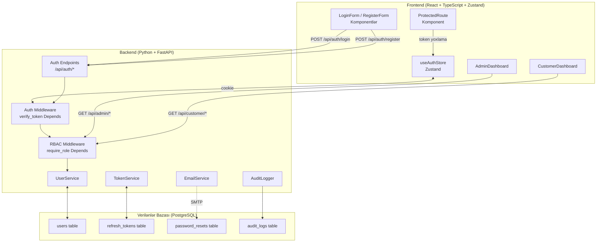
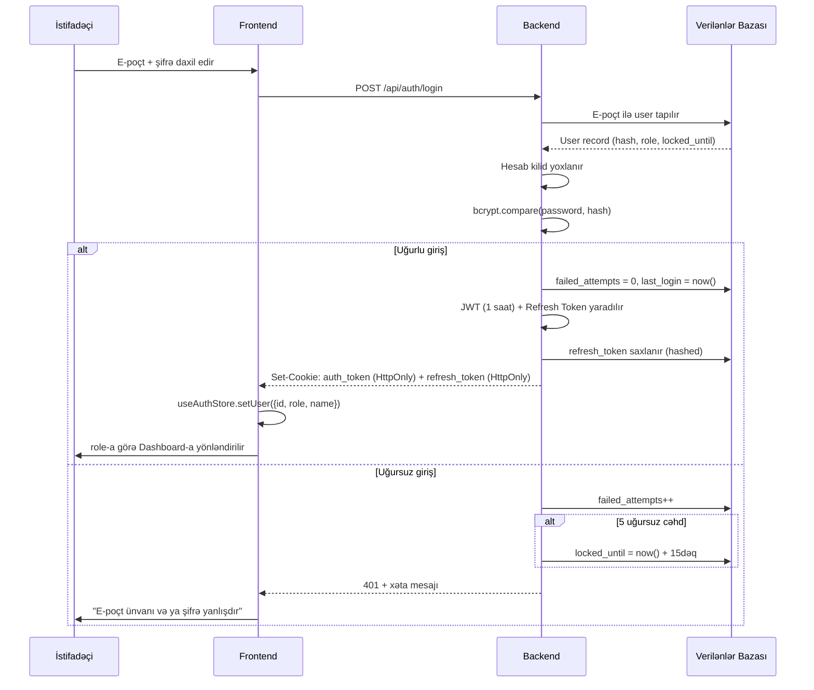
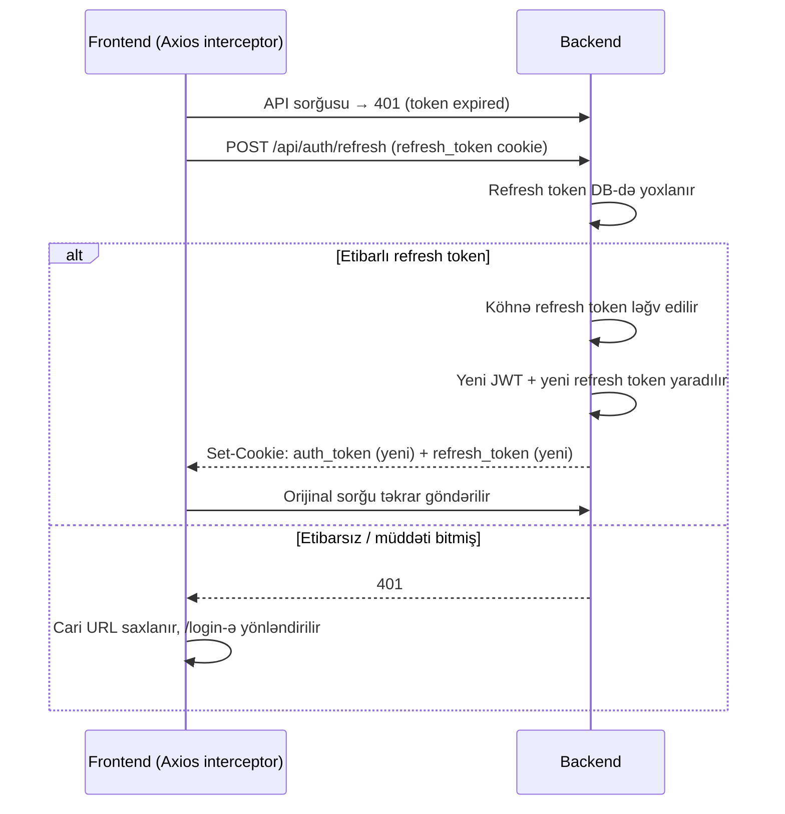
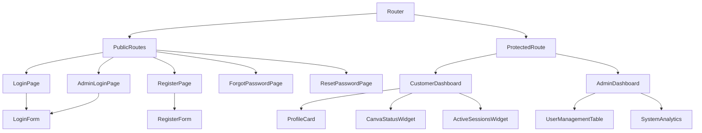

# Design Document: User Authentication

## Overview

Bu feature, FikirBiz platforması üçün tam istifadəçi autentifikasiyası, sessiya idarəetməsi və rol əsaslı giriş nəzarəti sistemini təmin edir. Sistem iki rol üzərindən işləyir: `admin` (idarəetmə paneli, `/admin/*` marşrutları) və `customer` (AI chat interfeysi, Canva connector). Mövcud `canva-ai-connector` feature-u bu sistem üzərindən qorunur — yalnız autentifikasiya edilmiş müştərilər Canva connector-u istifadə edə bilir.

### Əsas Texniki Qərarlar

| Qərar | Seçim | Səbəb |
|---|---|---|
| Şifrə hashing | **bcrypt** (cost factor 12) | OWASP tövsiyəsi; passlib kitabxanası ilə Python-da sadə inteqrasiya |
| Auth token | **JWT** (HS256, 1 saat) | Stateless, rol claim-i daşıyır; python-jose ilə idarə |
| Refresh token | **Opaque token + DB rotation** | Oğurlanma halında revoke edilə bilir; rotation ilə replay attack riski azalır |
| Token saxlama | **HttpOnly + Secure + SameSite=Strict cookie** | XSS hücumlarından qorunur; localStorage-dan daha təhlükəsiz |
| Rate limiting | **slowapi** (per-IP + per-account) | FastAPI üçün Flask-Limiter-dən ilham alan, Starlette uyğun rate limiter |
| RBAC | **JWT `role` claim + FastAPI Depends()** | Hər HTTP sorğusunda server-side yoxlama; dependency injection ilə təmiz kod |
| Frontend routing | **React Router v6 `ProtectedRoute` komponent** | Rol əsaslı yönləndirmə; `useAuthStore` (Zustand) ilə inteqrasiya |
| E-poçt | **FastAPI-Mail + SMTP** | Şifrə sıfırlama məktubları; async e-poçt göndərmə |
| ORM | **SQLAlchemy 2.0 (async)** | PostgreSQL ilə async sorğular; Alembic ilə migration |

### Araşdırma Tapıntıları

**bcrypt vs Argon2id**: OWASP hər ikisini qəbul edir. bcrypt cost factor 12 (Python passlib üçün ~250ms) seçildi — sınanmış kitabxana, geniş dəstək. 72-bayt limit olmadıqca Argon2id üstün deyil.

**JWT Refresh Token Rotation**: Hər access token yeniləməsində köhnə refresh token ləğv edilib yenisi verilir. Oğurlanmış token istifadə edilərsə, qanuni istifadəçinin növbəti refresh cəhdindən dərhal aşkar olunur.

**Cookie vs localStorage**: HttpOnly cookie-lər JavaScript-ə görünmür, XSS hücumlarından qorunur. `SameSite=Strict` CSRF riskini minimuma endirir. [JWT storage tövsiyəsi](https://cheatsheetseries.owasp.org/cheatsheets/HTML5_Security_Cheat_Sheet.html)

**slowapi**: FastAPI-nin Starlette infrastrukturu üzərində işləyən rate limiter. IP əsaslı limitlər giriş endpointlərini qoruyur. Hesab kilidi ayrıca DB sütunu ilə idarə olunur (5 uğursuz cəhd → 15 dəqiqə kilid).


---

## Architecture

Sistem üç qatdan ibarətdir: React frontend (Zustand state), Express backend (JWT middleware + RBAC), və verilənlər bazası (users, refresh_tokens, audit_logs, password_resets cədvəlləri).



### Autentifikasiya Axını (Login)



### Token Refresh Axını




---

## Components and Interfaces

### Frontend Komponentlər



#### `ProtectedRoute` — Giriş Qapısı

```typescript
interface ProtectedRouteProps {
  allowedRoles: ('admin' | 'customer')[];
  redirectTo?: string;  // Default: rol əsaslı (/login və ya /admin/login)
  children: React.ReactNode;
}

// İş məntiqi:
// 1. useAuthStore-dan user oxunur
// 2. Token yoxdursa → redirectTo-ya yönləndirilir
// 3. Rol uyğun deyilsə → rol dashboard-ına yönləndirilir
// 4. Uyğundursa → children render edilir
```

#### `LoginForm`

```typescript
interface LoginFormProps {
  variant: 'customer' | 'admin';  // Admin formda xüsusi header
  onSuccess?: () => void;
}

interface LoginFormState {
  email: string;
  password: string;
  rememberMe: boolean;
  showPassword: boolean;
  isLoading: boolean;
  error: string | null;
  lockedUntil: Date | null;  // Kilid vəziyyəti üçün
}
```

#### `RegisterForm`

```typescript
interface RegisterFormState {
  firstName: string;    // maks 50 simvol
  lastName: string;     // maks 50 simvol
  email: string;        // maks 254 simvol, RFC 5322
  password: string;
  isLoading: boolean;
  fieldErrors: {
    firstName?: string;
    lastName?: string;
    email?: string;
    password?: PasswordValidationError[];
  };
}

type PasswordValidationError =
  | 'TOO_SHORT'          // < 8 simvol
  | 'NO_UPPERCASE'       // böyük hərf yoxdur
  | 'NO_DIGIT'           // rəqəm yoxdur
  | 'NO_SPECIAL_CHAR';   // !@#$%^&* yoxdur
```

#### `UserManagementTable` (Admin)

```typescript
interface UserTableRow {
  id: string;
  firstName: string;
  lastName: string;
  email: string;
  registeredAt: string;   // ISO 8601
  lastLoginAt: string | null;
  isActive: boolean;
}

interface UserManagementTableProps {
  pageSize: 50;            // Sabit, Req 3.5
  onDeactivate: (userId: string) => Promise<void>;
  onReactivate: (userId: string) => Promise<void>;
}
```

### Backend API Endpointləri

```python
# ─── Auth Endpointləri (FastAPI router) ─────────────────────────────

from pydantic import BaseModel, EmailStr
from typing import Optional

# Müştəri qeydiyyatı
# POST /api/auth/register
class RegisterRequest(BaseModel):
    first_name: str      # max 50 simvol
    last_name: str       # max 50 simvol
    email: EmailStr      # max 254 simvol, RFC 5322
    password: str
# Success: 201 + Set-Cookie (auth_token, refresh_token)
# Errors:  400 (validasiya), 409 (e-poçt mövcuddur), 429 (rate limit)

# Giriş (customer + admin eyni endpoint, rol JWT-dən alınır)
# POST /api/auth/login
class LoginRequest(BaseModel):
    email: EmailStr
    password: str
    remember_me: Optional[bool] = False
# Success: 200 + Set-Cookie
# Errors:  401 (yanlış məlumat), 423 (hesab kilidli, locked_until qaytarılır), 429

# Token yeniləmə
# POST /api/auth/refresh
# Cookie: refresh_token
# Success: 200 + Set-Cookie (yeni cüt)
# Errors:  401 (etibarsız / müddəti bitmiş)

# Çıxış
# POST /api/auth/logout
# Cookie: auth_token + refresh_token
# Success: 200 + cookie-lər silinir

# Şifrə sıfırlama — sorğu
# POST /api/auth/forgot-password
class ForgotPasswordRequest(BaseModel):
    email: EmailStr
# Success: 200 (həmişə eyni mesaj)
# Errors:  429 (3 sorğu/saat aşıldı)

# Şifrə sıfırlama — token yoxlama
# GET /api/auth/reset-password/{token}
# Success: 200 | Errors: 400

# Şifrə sıfırlama — yeniləmə
# POST /api/auth/reset-password/{token}
class ResetPasswordRequest(BaseModel):
    new_password: str
# Success: 200 | Errors: 400

# ─── Admin Endpointləri (Depends(require_role("admin"))) ─────────────

# GET  /api/admin/users?page=1&search=      # Siyahı, max 50/səhifə
# PUT  /api/admin/users/{user_id}/deactivate
# PUT  /api/admin/users/{user_id}/reactivate
# GET  /api/admin/analytics
# GET  /api/admin/audit-logs

# ─── Müştəri Endpointləri (Depends(require_role("customer"))) ────────

# GET    /api/customer/profile
# PUT    /api/customer/profile
# PUT    /api/customer/password
# DELETE /api/customer/account
```


### FastAPI Dependency Zənciri

```python
from fastapi import Depends, HTTPException, Cookie
from jose import jwt, JWTError

# verify_token — JWT yoxlanır (FastAPI Depends)
async def verify_token(auth_token: str = Cookie(None)) -> JWTPayload:
    if not auth_token:
        raise HTTPException(status_code=401, detail={"code": "NO_TOKEN"})
    try:
        payload = jwt.decode(auth_token, settings.JWT_SECRET, algorithms=["HS256"])
        return JWTPayload(**payload)
    except JWTError:
        raise HTTPException(status_code=401, detail={"code": "INVALID_TOKEN"})

# require_role — rol yoxlanır (server-side)
def require_role(*roles: str):
    async def checker(user: JWTPayload = Depends(verify_token)):
        if user.role not in roles:
            raise HTTPException(status_code=403, detail={"code": "FORBIDDEN"})
        return user
    return checker

# Endpoint nümunələri:
@router.get("/api/admin/users")
async def list_users(user: JWTPayload = Depends(require_role("admin"))):
    ...

@router.get("/api/customer/profile")
async def get_profile(user: JWTPayload = Depends(require_role("customer"))):
    ...
```

### Zustand Auth Store (Frontend)

```typescript
interface AuthUser {
  id: string;
  email: string;
  firstName: string;
  lastName: string;
  role: 'admin' | 'customer';
}

interface AuthState {
  user: AuthUser | null;
  isLoading: boolean;           // Token yoxlama zamanı (hydration)
  isAuthenticated: boolean;

  // Actions
  login: (email: string, password: string, rememberMe: boolean) => Promise<void>;
  register: (data: RegisterData) => Promise<void>;
  logout: () => Promise<void>;
  refreshToken: () => Promise<boolean>;
  checkAuth: () => Promise<void>;  // App başlayanda cookie yoxlanır
  setUser: (user: AuthUser | null) => void;

  // Redirect saxlama (Req 5.5)
  redirectAfterLogin: string | null;
  setRedirectAfterLogin: (path: string | null) => void;
}
```

---

## Data Models

### Verilənlər Bazası Sxemi (PostgreSQL)

```sql
-- İstifadəçilər
CREATE TABLE users (
  id              UUID PRIMARY KEY DEFAULT gen_random_uuid(),
  first_name      VARCHAR(50)  NOT NULL,
  last_name       VARCHAR(50)  NOT NULL,
  email           VARCHAR(254) NOT NULL UNIQUE,
  password_hash   VARCHAR(72)  NOT NULL,  -- bcrypt output
  role            VARCHAR(10)  NOT NULL DEFAULT 'customer' CHECK (role IN ('admin','customer')),
  is_active       BOOLEAN      NOT NULL DEFAULT true,
  failed_attempts SMALLINT     NOT NULL DEFAULT 0,
  locked_until    TIMESTAMPTZ,
  last_login_at   TIMESTAMPTZ,
  created_at      TIMESTAMPTZ  NOT NULL DEFAULT now(),
  updated_at      TIMESTAMPTZ  NOT NULL DEFAULT now()
);
CREATE INDEX idx_users_email ON users(email);

-- Refresh Token-lər
CREATE TABLE refresh_tokens (
  id          UUID PRIMARY KEY DEFAULT gen_random_uuid(),
  user_id     UUID        NOT NULL REFERENCES users(id) ON DELETE CASCADE,
  token_hash  VARCHAR(64) NOT NULL UNIQUE,  -- SHA-256 hash
  expires_at  TIMESTAMPTZ NOT NULL,
  created_at  TIMESTAMPTZ NOT NULL DEFAULT now(),
  is_revoked  BOOLEAN     NOT NULL DEFAULT false
);
CREATE INDEX idx_rt_user_id  ON refresh_tokens(user_id);
CREATE INDEX idx_rt_hash     ON refresh_tokens(token_hash);

-- Şifrə Sıfırlama Token-ləri
CREATE TABLE password_resets (
  id          UUID PRIMARY KEY DEFAULT gen_random_uuid(),
  user_id     UUID        NOT NULL REFERENCES users(id) ON DELETE CASCADE,
  token_hash  VARCHAR(64) NOT NULL UNIQUE,
  expires_at  TIMESTAMPTZ NOT NULL,  -- now() + 30 dəqiqə
  used_at     TIMESTAMPTZ,
  created_at  TIMESTAMPTZ NOT NULL DEFAULT now()
);

-- Audit Log-lar
CREATE TABLE audit_logs (
  id          UUID PRIMARY KEY DEFAULT gen_random_uuid(),
  actor_id    UUID        NOT NULL REFERENCES users(id),
  action      VARCHAR(50) NOT NULL,  -- 'DEACTIVATE', 'REACTIVATE', 'ROLE_CHANGE', 'DELETE'
  target_id   UUID,                  -- Əməliyyat edilən user
  metadata    JSONB,                 -- Əlavə kontekst
  created_at  TIMESTAMPTZ NOT NULL DEFAULT now()
);
CREATE INDEX idx_audit_actor  ON audit_logs(actor_id);
CREATE INDEX idx_audit_action ON audit_logs(action);
```


### JWT Payload Strukturu

```typescript
interface JWTPayload {
  sub: string;       // user.id (UUID)
  role: 'admin' | 'customer';
  email: string;
  iat: number;       // issued at
  exp: number;       // now + 3600 saniyə (1 saat)
}
```

### Rate Limiting Konfiqurasiyası

```python
# slowapi ilə FastAPI rate limiting
from slowapi import Limiter
from slowapi.util import get_remote_address

limiter = Limiter(key_func=get_remote_address)

# Giriş endpointi — IP əsaslı (15 dəqiqədə 20 cəhd)
@router.post("/api/auth/login")
@limiter.limit("20/15minutes")
async def login(request: Request, body: LoginRequest): ...

# Qeydiyyat — e-poçt + IP əsaslı (10 dəqiqədə 5 cəhd)
@router.post("/api/auth/register")
@limiter.limit("5/10minutes", key_func=lambda req: req.body.get("email") or get_remote_address(req))
async def register(request: Request, body: RegisterRequest): ...

# Şifrə sıfırlama (1 saatda 3 cəhd)
@router.post("/api/auth/forgot-password")
@limiter.limit("3/hour", key_func=lambda req: req.body.get("email") or get_remote_address(req))
async def forgot_password(request: Request, body: ForgotPasswordRequest): ...
```

### Müştəri Profil Görünüşü (Frontend State)

```typescript
interface CustomerProfile {
  id: string;
  firstName: string;
  lastName: string;
  email: string;
  registeredAt: string;
  canvaConnectorStatus: 'connected' | 'disconnected' | 'error';
  activeChatSessionCount: number;
}

interface AdminAnalytics {
  totalUsers: number;
  newUsersToday: number;
  activeSessionsCount: number;
}
```

---

## UI Dizayn Qaydaları (FikirBiz Brend)

### Login / Register Form Tətbiqi

```
Səhifə arxa planı    → bg-brand-ivory (#EFE7DC)
Form konteyneri      → bg-brand-white shadow-md rounded-lg
Logo header          → bg-brand-navy, "Fikir" text-brand-white, "Biz" text-brand-gold
Input sahəsi         → bg-brand-white border-brand-gray placeholder:text-brand-gray
                       focus:ring-brand-gold focus:border-brand-gold
Submit düyməsi       → bg-brand-gold text-brand-navy hover:bg-[#B8962E]
                       disabled:bg-brand-gray disabled:cursor-not-allowed
Link rəngi           → text-brand-khaki hover:text-brand-navy
Xəta mesajı          → text-red-600 (WCAG uyğun)
Admin login header   → bg-brand-navy text-brand-white (admin badge: text-brand-gold)
```

### Admin Dashboard Tətbiqi

```
Sidebar              → bg-brand-navy text-brand-white
Aktiv menü elementi  → bg-brand-gold text-brand-navy
Cədvəl başlığı       → bg-brand-navy text-brand-white
Aktiv hesab badge    → bg-brand-green text-brand-white
Deaktiv hesab badge  → bg-brand-gray text-brand-khaki
Deaktiv düymə        → bg-red-600 text-white hover:bg-red-700
Bərpa düymə          → bg-brand-green text-white hover:bg-[#1a5a20]
```


---

## Correctness Properties

*A property is a characteristic or behavior that should hold true across all valid executions of a system — essentially, a formal statement about what the system should do. Properties serve as the bridge between human-readable specifications and machine-verifiable correctness guarantees.*

### Property 1: Şifrə validasiyası — hər tələb ayrıca yoxlanılır

*For any* şifrə sətri, validasiya funksiyası həmin şifrənin (a) minimum 8 simvol, (b) ən azı bir böyük hərf, (c) ən azı bir rəqəm, (d) ən azı bir xüsusi simvol (`!@#$%^&*`) ehtiva edib etmədiyini müstəqil olaraq yoxlamalı; tələbi pozan şifrə üçün hansı tələbin pozulduğunu bildirən xüsusi xəta kodu qaytarmalıdır.

**Validates: Requirements 1.4, 1.5, 4.6**

---

### Property 2: Qeydiyyatda yaradılan hesab həmişə `customer` roluna malikdir

*For any* etibarlı qeydiyyat məlumatları (ad, soyad, unikal e-poçt, etibarlı şifrə) ilə göndərilən sorğu nəticəsində yaradılan istifadəçinin `role` sahəsi `'customer'` olmalıdır — heç bir halda `'admin'` ola bilməz.

**Validates: Requirements 1.7**

---

### Property 3: Form xəta recovery — şifrə silinir, digər sahələr qorunur

*For any* giriş və ya qeydiyyat form göndərməsi zamanı baş verən server xətası (4xx, 5xx, şəbəkə xətası), form state-də şifrə sahəsi boşaldılmalı; ad, soyad (varsa) və e-poçt sahəsinin dəyərləri dəyişilməz qalmalıdır.

**Validates: Requirements 1.11, 2.10**

---

### Property 4: Qeydiyyat rate limit — 5 cəhddən sonra blok baş verir

*For any* eyni e-poçt ünvanından 10 dəqiqəlik pəncərədə edilən ardıcıl cəhd seriyasında, 5-ci cəhddən sonrakı hər cəhd blok cavabı (HTTP 429) ilə rədd edilməlidir; blok cavabında qalan kilid müddəti göstərilməlidir.

**Validates: Requirements 1.10**

---

### Property 5: Giriş — rol əsaslı redirect

*For any* uğurlu autentifikasiya cavabı, yönləndirmə URL-i istifadəçinin `role` dəyərinə uyğun olmalıdır: `'admin'` → `/admin/dashboard`, `'customer'` → `/customer/dashboard`. Heç bir halda rol fərqli dashboard-a yönləndirilməməlidir.

**Validates: Requirements 2.3, 3.2**

---

### Property 6: Hesab kilidi invariantı — 5 uğursuz giriş + qalan müddət

*For any* ardıcıl 5 uğursuz giriş cəhdindən sonra həmin hesaba edilən altıncı giriş cəhdi HTTP 423 ilə rədd edilməli; cavabda `locked_until` (ISO 8601) sahəsi mövcud olmalı və `locked_until - now() ≈ 15 dəqiqə` (±5 saniyə) invariantı qorunmalıdır.

**Validates: Requirements 2.5, 2.6**

---

### Property 7: Auth_Token ömrü — hər etibarlı giriş üçün 1 saat

*For any* uğurlu giriş cavabında verilən JWT-nin `exp - iat = 3600` saniyə (±5 saniyə) olmalıdır.

**Validates: Requirements 2.7**

---

### Property 8: Şifrəni göstər/gizlət toggle idempotentliyi

*For any* cüt sayda (2n, n≥1) toggle əməliyyatı, şifrə input tipinin görünürlüyü ilkin vəziyyətinə qayıtmalıdır; tək sayda (2n+1) toggle-dan sonra vəziyyət əks olmalıdır.

**Validates: Requirements 2.11**

---

### Property 9: Customer rolu admin marşrutuna daxil ola bilməz

*For any* `'customer'` roluna malik JWT ilə `/api/admin/*` endpointinə edilən istənilən HTTP sorğusu HTTP 403 ilə rədd edilməli; frontend-də həmin istifadəçi `/customer/dashboard`-a yönləndirilməlidir.

**Validates: Requirements 3.3, 7.5**

---

### Property 10: Hesab deaktivləşdirməsi — token dərhal etibarsız olur

*For any* aktiv `'customer'` hesabının admin tərəfindən deaktivləşdirilməsindən sonra 1 saniyə ərzində həmin istifadəçinin əvvəlki auth_token-i ilə edilən API sorğusu HTTP 401 qaytarmalıdır.

**Validates: Requirements 3.7**

---

### Property 11: Hesab bərpası — köhnə tokenlər bərpa olunmur

*For any* deaktiv edilmiş hesabın bərpasından sonra bərpadan əvvəl verilmiş refresh tokenlərin heç biri ilə yeni access token almaq mümkün olmamalıdır (HTTP 401); yalnız yeni giriş ilə yeni token alına bilər.

**Validates: Requirements 3.8**

---

### Property 12: Admin əməliyyatları audit log-da iz buraxır

*For any* admin tərəfindən yerinə yetirilən idarəetmə əməliyyatı (deaktivləşdirmə, bərpa, rol dəyişikliyi, silmə), `audit_logs` cədvəlində həmin əməliyyata aid qeyd mövcud olmalıdır; qeyddə `actor_id`, `action`, `target_id` və `created_at` sahələri dolu olmalıdır.

**Validates: Requirements 3.9**

---

### Property 13: Admin öz hesabını deaktiv edə bilməz

*For any* admin identifikatoruna malik istifadəçinin öz `id`-si ilə deaktivləşdirmə sorğusu göndərməsi, həmişə HTTP 400/403 ilə rədd edilməlidir; `users` cədvəlindəki `is_active` sahəsi dəyişilməz qalmalıdır.

**Validates: Requirements 3.11**

---

### Property 14: Şifrə sıfırlama — e-poçt mövcudluğu açıqlanmır

*For any* `POST /api/auth/forgot-password` sorğusunda — istər sistemdə mövcud olan, istər mövcud olmayan e-poçt ünvanı ilə — HTTP status kodu və cavab mesajı eyni olmalıdır.

**Validates: Requirements 4.3**

---

### Property 15: Sıfırlama tokeni müddəti — 30 dəqiqə invariantı

*For any* yaradılan şifrə sıfırlama tokeninin `expires_at - created_at` fərqi 1800 saniyə (±5 saniyə) olmalıdır.

**Validates: Requirements 4.4**

---

### Property 16: Şifrə sıfırlama sonrası bütün sessionlar bitir

*For any* uğurlu şifrə sıfırlamasından sonra həmin istifadəçiyə aid bütün aktiv refresh tokenləri etibarsız olmalı; sıfırlama tokeni `used_at` damğalanmış olmalıdır. Əvvəlki tokenlərlə edilən yenilənmə sorğuları HTTP 401 qaytarmalıdır.

**Validates: Requirements 4.7**

---

### Property 17: Şifrə sıfırlama rate limit — 3 sorğudan sonra blok

*For any* eyni e-poçtdan 1 saatlik pəncərədə 3 sıfırlama sorğusundan sonra edilən dördüncü sorğu HTTP 429 ilə rədd edilməlidir.

**Validates: Requirements 4.9**

---

### Property 18: Çıxış sonrası token etibarsızlaşdırma

*For any* uğurlu çıxış əməliyyatından sonra istifadə edilmiş `auth_token` və `refresh_token` ilə edilən istənilən API sorğusu HTTP 401 qaytarmalıdır.

**Validates: Requirements 5.2**

---

### Property 19: Token refresh round-trip

*For any* müddəti bitmiş JWT ilə yanaşı etibarlı `refresh_token` mövcud olduqda, `/api/auth/refresh` endpointi yeni `auth_token` + yeni `refresh_token` cütü qaytarmalı; köhnə refresh token dərhal etibarsız olmalıdır (rotation).

**Validates: Requirements 5.4**

---

### Property 20: Redirect URL saxlama — sessiya bitdikdən sonra geri qayıtma

*For any* qorunan marşrutda sessiya bitmesindən (expired token) sonra istifadəçi uğurla yenidən giriş etdikdə, `useAuthStore.redirectAfterLogin` dəyərinin sesiya bitmeden öncəki URL ilə eyniliyini yoxla.

**Validates: Requirements 5.5, 5.6**

---

### Property 21: İnaktivlik timeout — 60 dəqiqə

*For any* 60 dəqiqə boyunca heç bir API sorğusu edilməmiş aktiv sessiya, növbəti sorğuda `idle_timeout` cavabı almalı; sessiya avtomatik bitmiş olmalıdır.

**Validates: Requirements 5.7**

---

### Property 22: Protected Route — token yoxdursa/etibarsızdırsa rədd et

*For any* etibarsız, müddəti bitmiş, yaxud tamamilə olmayan `auth_token` ilə edilən hər hansı `/api/admin/*` və ya `/api/customer/*` sorğusu HTTP 401 qaytarmalıdır.

**Validates: Requirements 5.8, 5.9, 7.1, 7.2**

---

### Property 23: Auth_Token cookie atributları invariantı

*For any* uğurlu giriş cavabında `Set-Cookie` header-ında yer alan `auth_token` cookie-si `HttpOnly`, `Secure` və `SameSite=Strict` atributlarının hamısını birlikdə ehtiva etməlidir.

**Validates: Requirements 5.10**

---

### Property 24: Rol icazə matrisi — cross-role sorğular rədd edilir

*For any* `'customer'` tokenli sorğu `/api/admin/*` endpointinə, yaxud `'admin'` tokenli sorğu `/api/customer/{customerId}/*` endpointinə edildiqdə HTTP 403 qaytarılmalıdır.

**Validates: Requirements 7.3, 7.4, 7.6**

---

### Property 25: Rol dəyişikliyi — köhnə token 60 saniyə sonra etibarsız

*For any* istifadəçinin rolu dəyişdirildikdən sonra 60 saniyə içərisində köhnə `auth_token` ilə qorunan resursa edilən sorğu köhnə rolun icazə vermədiyi resurslara daxil olma cəhdini HTTP 401/403 ilə rədd etməlidir.

**Validates: Requirements 7.8**

---

### Property 26: Admin istifadəçi siyahısı — sayfalama limiti

*For any* `/api/admin/users` sorğusuna cavabında qaytarılan `items` massivinin uzunluğu həmişə `≤50` olmalıdır.

**Validates: Requirements 3.5**

---

### Property 27: Responsive layout — horizontal overflow yoxdur

*For any* 320px ilə 2560px arasındakı viewport genişliyindəki giriş, qeydiyyat və admin giriş formalarında `document.body.scrollWidth <= window.innerWidth` invariantı qorunmalıdır.

**Validates: Requirements 8.1**

---

### Property 28: Form elementlərinin ARIA atributları tamlığı

*For any* render edilmiş form input elementi (`input`, `button`, `a`) üçün `aria-label` (yaxud `aria-labelledby`) atributu mövcud olmalıdır; xəta mesajı göstərilən elementdə `aria-describedby` atributu müvafiq xəta elementinin id-sinə işarə etməlidir.

**Validates: Requirements 8.4**

---

### Property 29: Keyboard navigation əhatəliliyi

*For any* autentifikasiya formundakı hər bir interaktiv element (`input`, `button`, `a`), `Tab` klavişi ardıcıllığında `document.activeElement` o elementə bərabər olan mərhələ mövcud olmalıdır.

**Validates: Requirements 8.5**

---

### Property 30: Mobil touch target ölçüsü

*For any* 320px–767px viewport genişliyindəki bütün toxunma hədəflərinin (`button`, `a`, `input`) `getBoundingClientRect()` çıxışında `width ≥ 44` və `height ≥ 44` olmalıdır.

**Validates: Requirements 8.6**

---

### Property 31: Loading state — submit düyməsi deaktiv, spinner görünür

*For any* form göndərməsi başladıqda (`isLoading = true`) submit düyməsinin `disabled` atributu mövcud olmalı; `isLoading = false` olduqda düymə yenidən aktiv olmalıdır.

**Validates: Requirements 8.7**


---

## Error Handling

### Xəta Kateqoriyaları və Cavablar

| Xəta kodu | HTTP | Səbəb | UI Reaksiyası | Recovery |
|---|---|---|---|---|
| `INVALID_CREDENTIALS` | 401 | Yanlış e-poçt/şifrə | "E-poçt ünvanı və ya şifrə yanlışdır" | Yenidən cəhd et |
| `ACCOUNT_LOCKED` | 423 | 5 uğursuz cəhd | "Hesab X dəqiqə kilidlənib" (geri sayım) | 15 dəq gözlə |
| `ACCOUNT_INACTIVE` | 403 | Admin tərəfindən deaktiv | "Hesabınız deaktiv edilib, admin ilə əlaqə saxlayın" | Admin ilə əlaqə |
| `EMAIL_TAKEN` | 409 | Qeydiyyatda mövcud e-poçt | "Bu e-poçt ünvanı artıq qeydiyyatdadır" | Başqa e-poçt |
| `VALIDATION_ERROR` | 400 | Sahə validasiyası | Hər sahənin yanında spesifik xəta | Sahəni düzəlt |
| `TOKEN_EXPIRED` | 401 | JWT müddəti bitib | Refresh cəhdi → uğursuzsa login | Refresh/Login |
| `INVALID_TOKEN` | 401 | Token yanlış/dəyişdirilib | Login səhifəsinə yönləndirilir | Yenidən giriş |
| `FORBIDDEN` | 403 | Rol icazəsi yoxdur | Öz dashboard-a yönləndirilir | — |
| `RESET_TOKEN_INVALID` | 400 | Sıfırlama linki etibarsız/istifadə edilmiş | "Bu link artıq etibarsızdır" + yeni sorğu linki | Yeni sorğu göndər |
| `RATE_LIMITED` | 429 | Limit aşımı | "X dəqiqə sonra yenidən cəhd edin" | Gözlə |
| `SELF_DEACTIVATION` | 400 | Admin öz hesabını deaktiv etməyə çalışır | "Öz hesabınızı deaktiv edə bilməzsiniz" | — |
| `NETWORK_ERROR` | — | Şəbəkə kəsilməsi | Xəta + "Yenidən cəhd et" düyməsi | Manual retry |
| `SERVER_ERROR` | 500 | Gözlənilməz server xətası | Ümumi xəta mesajı (stack trace gizlənir) | Yenidən cəhd et |

### Təhlükəsizlik Prinsipləri

```
1. Error message minimalism: Xəta mesajları heç vaxt stack trace, SQL xətası,
   daxili sistem məlumatı göstərmir. Yalnız kateqoriya kodu + user-friendly mesaj.

2. Timing attack qoruması: Giriş cavabları — həm mövcud həm mövcud olmayan
   hesab üçün eyni vaxt çərçivəsindədir (bcrypt.compare həmişə çalışır).

3. Enumeration qoruması: "Şifrəni unutdum?" axınında e-poçt mövcudluğu
   açıqlanmır (həmişə eyni mesaj — Property 14).

4. Token sızması qoruması: auth_token heç bir API cavabında,
   log faylında, yaxud UI elementinin DOM-unda açıq mətn şəklində görünmür.
```

### Frontend Xəta İdarəetməsi (Axios Interceptor)

```typescript
// 401 → Token refresh cəhdi, uğursuzsa login
// 403 → Rol dashboard-ına yönləndirilir
// 423 → locked_until-dan geri sayım başladılır
// 429 → retry-after header-ından kilid müddəti alınır
// 5xx → Ümumi xəta toast bildirişi

axiosInstance.interceptors.response.use(
  (response) => response,
  async (error) => {
    const { status, data } = error.response ?? {};
    if (status === 401 && data?.detail?.code !== 'INVALID_CREDENTIALS') {
      const refreshed = await authStore.refreshToken();
      if (refreshed) return axiosInstance.request(error.config);
      authStore.setRedirectAfterLogin(window.location.pathname);
      router.push('/login');
    }
    return Promise.reject(error);
  }
);
// Not: FastAPI xəta cavabları detail.code formatında qaytarılır
```

---

## Testing Strategy

### Dual Testing Yanaşması

Bu feature həm unit/example testlər, həm də property-based testlər ilə yoxlanılır.

#### Property-Based Testing (PBT)

PBT kitabxanası: **fast-check** (TypeScript/JavaScript)
Minimum iterasiya sayı: **100** hər property üçün

Hər property testi aşağıdakı tag formatı ilə annotasiya olunmalıdır:
```
// Feature: user-authentication, Property {N}: {property_text}
```

| Property | Test faylı | fast-check strategiyası |
|---|---|---|
| P1: Şifrə validasiyası | `passwordValidator.pbt.test.ts` | `fc.string()` + custom invalid variants |
| P2: Qeydiyyat default rolu | `register.pbt.test.ts` | `fc.record({firstName, lastName, email, password})` |
| P3: Form xəta recovery | `formErrorRecovery.pbt.test.ts` | `fc.constantFrom(400,500,503,0)` xəta kodu |
| P4: Qeydiyyat rate limit | `registerRateLimit.pbt.test.ts` | `fc.integer({min:6,max:20})` ardıcıl cəhd sayı |
| P5: Rol əsaslı redirect | `loginRedirect.pbt.test.ts` | `fc.constantFrom('admin','customer')` |
| P6: Hesab kilidi invariantı | `accountLockout.pbt.test.ts` | `fc.integer({min:5,max:20})` uğursuz cəhd |
| P7: JWT ömrü | `jwtLifetime.pbt.test.ts` | `fc.record({email,password})` etibarlı giriş |
| P8: Şifrə toggle idempotentliyi | `passwordToggle.pbt.test.ts` | `fc.integer({min:1,max:10})` toggle sayı |
| P9: Customer → admin 403 | `rbacCustomer.pbt.test.ts` | `fc.constantFrom(adminEndpoints)` |
| P10: Deaktivləşdirmə → token etibarsız | `deactivateToken.pbt.test.ts` | `fc.uuid()` user ID |
| P11: Bərpa → köhnə token etibarsız | `reactivateToken.pbt.test.ts` | `fc.uuid()` user ID |
| P12: Audit log doluluğu | `auditLog.pbt.test.ts` | `fc.constantFrom(adminActions)` |
| P13: Self-deactivation rədd | `selfDeactivate.pbt.test.ts` | Hər admin öz id-si ilə |
| P14: Forgot-password məxfiliyi | `forgotPasswordPrivacy.pbt.test.ts` | `fc.emailAddress()` |
| P15: Reset token müddəti | `resetTokenExpiry.pbt.test.ts` | `fc.emailAddress()` |
| P16: Reset sonrası sessionlar | `resetSessionInvalidation.pbt.test.ts` | `fc.uuid()` session IDs |
| P17: Reset rate limit | `resetRateLimit.pbt.test.ts` | `fc.integer({min:4,max:10})` cəhd sayı |
| P18: Logout token etibarsız | `logoutTokenInvalidation.pbt.test.ts` | `fc.uuid()` token |
| P19: Refresh token rotation | `tokenRotation.pbt.test.ts` | `fc.uuid()` refresh token |
| P20: Redirect URL saxlama | `redirectAfterLogin.pbt.test.ts` | `fc.webPath()` URL |
| P21: İnaktivlik timeout | `idleTimeout.pbt.test.ts` | `fc.integer({min:60,max:120})` dəqiqə |
| P22: Protected route guard | `protectedRoute.pbt.test.ts` | `fc.constantFrom(invalidTokens)` |
| P23: Cookie atributları | `cookieAttributes.pbt.test.ts` | Hər etibarlı giriş üçün |
| P24: Cross-role 403 | `crossRoleForbidden.pbt.test.ts` | `fc.constantFrom(roleEndpointMatrix)` |
| P25: Rol dəyişikliyi invalidation | `roleChangeInvalidation.pbt.test.ts` | `fc.constantFrom('admin','customer')` |
| P26: Sayfalama limiti | `paginationLimit.pbt.test.ts` | `fc.integer({min:1,max:1000})` DB record sayı |
| P27: Responsive layout | `responsiveLayout.pbt.test.ts` | `fc.integer({min:320,max:2560})` viewport |
| P28: ARIA atributları | `ariaAttributes.pbt.test.ts` | `fc.constantFrom(formElements)` |
| P29: Keyboard nav | `keyboardNavigation.pbt.test.ts` | `fc.array(interactiveElementArb)` |
| P30: Touch target ölçüsü | `touchTarget.pbt.test.ts` | `fc.integer({min:320,max:767})` viewport |
| P31: Loading state | `loadingState.pbt.test.ts` | `fc.boolean()` isLoading |


#### Unit / Example Testlər

```
# Backend (pytest + pytest-asyncio)
backend/
├── tests/
│   ├── test_auth_routes.py          # Login, register, logout, refresh axını
│   ├── test_token_service.py        # JWT yaratma, verify, refresh rotation
│   ├── test_password_service.py     # bcrypt hash, compare, reset flow
│   ├── test_email_service.py        # Mock SMTP, şablon dəyişənləri
│   ├── test_rbac.py                 # require_role dependency, admin/customer icazə
│   ├── test_rate_limiter.py         # slowapi limit yoxlanması
│   └── test_admin_routes.py         # Admin CRUD, deaktivləşdirmə, audit log

# Frontend (Vitest + React Testing Library)
src/
├── components/auth/
│   ├── LoginForm.test.tsx
│   ├── RegisterForm.test.tsx
│   ├── AdminLoginForm.test.tsx
│   ├── ForgotPasswordForm.test.tsx
│   └── ResetPasswordForm.test.tsx
├── components/admin/
│   ├── UserManagementTable.test.tsx
│   └── SystemAnalytics.test.tsx
├── components/customer/
│   └── ProfileCard.test.tsx
└── store/
    └── authStore.test.ts
```

Unit test diqqət mərkəzləri:
- `rememberMe: true` → cookie maxAge = 30 gün; `false` → session cookie
- `/admin/login` sayfasında "FikirBiz Admin" badge-i (`bg-brand-gold text-brand-navy`)
- Mövcud e-poçt ilə qeydiyyatda "Bu e-poçt ünvanı artıq qeydiyyatdadır" mesajı
- İstifadə edilmiş reset link-ə kliklənməsi: "Bu link artıq etibarsızdır" mesajı + yeni sorğu linki
- Admin öz id-si ilə deaktiv sorğusu: 400/403 cavab, düymə disabled vəziyyəti
- `checkAuth()` — app başlayanda cookie-dən auth vəziyyəti bərpası

#### Integration Testlər

```typescript
// Giriş axını: POST /api/auth/login → JWT + cookie yoxlanır
// Refresh rotation: köhnə refresh istifadəsi → yeni cüt alınır, köhnə rədd edilir
// Deaktivləşdirmə pipeline: admin API → token etibarsız → audit log
// Şifrə sıfırlama axını: forgot → e-poçt mock → reset link → yeni şifrə → login
// RBAC pipeline: JWT → middleware → endpoint icazəsi
```

#### Smoke Testlər

```typescript
// WCAG 2.1 AA kontrast yoxlaması (axe-core):
// - bg-brand-navy (#0D1B2A) üzərində #FFFFFF → ~14:1 ✓
// - bg-brand-ivory (#EFE7DC) üzərində #0D1B2A → ~12:1 ✓
// - bg-brand-gold (#D4AF37) üzərində #0D1B2A → ~6:1 ✓ (CTA düymə)
```

#### Responsive / Accessibility Testlər

- Viewport breakpoint-ləri: 320px, 375px, 768px, 1024px, 1440px, 2560px
- WCAG 2.1 AA: axe-core ilə kontrast yoxlaması
- Keyboard navigation: Tab sırası, Enter/Space submit, Escape modal bağlama
- Touch hədəfləri: ≥44×44px (mobile viewport-larda)
- Screen reader: `aria-live` region ilə xəta mesajları elan edilir
